# Creación y publicación de un NFT

En este ejercicio vamos a crear y desplegar un contrato inteligente ERC-721 en la red de prueba de Goerli.

## Recursos usados

- [Visual Studio Code](https://code.visualstudio.com/), como IDE para desarrollar la solución.
- [Extensión Visual Studio Code Solidity](https://marketplace.visualstudio.com/items?itemName=JuanBlanco.solidity), como extensión para desarrollar sobre el IDE anterior código en [Solidity](https://solidity-es.readthedocs.io/es/latest/).
- [Hardhat](https://hardhat.org/), como entorno de desarrollo sobre la red Ethereum .
- [Pinata](https://www.pinata.cloud/), como plataforma para almacenar el contenido de nuestro NFT.
- [Alchemy](https://www.alchemy.com/), como plataforma de desarrollo sobre web3
- [Metamask](https://metamask.io/), como extensión del navegador que permite conexión directa con aplicaciones descentralizadas de la red Ethereum.
- [NodeJS](https://nodejs.org/en/), como entorno de servidor para desplegar el cliente que interactuará con la solución descentralizada.

## Paso 1

Para llevar a cabo nuestro ejercicio es necesario interactuar con la Red Ethereum y una forma fácil de hacerlo es mediante [Alchemy](https://www.alchemy.com/). Es necesario crear una cuenta.

## Paso 2

Para poder usar [Alchemy](https://www.alchemy.com/), necesitamos generar una clave API para una aplicación. De esta manera podremos enviar peticiones a la red de pruebas Goerli.

Vamos al panel de [Alchemy](https://www.alchemy.com/), y en el menú _Apps_ seleccionammos _Create App_

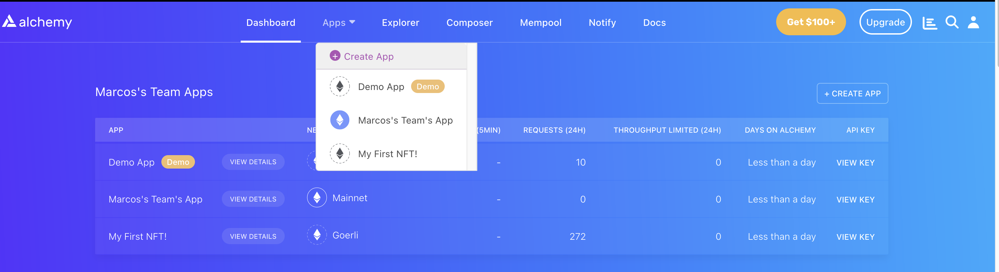

Le damos un nombre a la aplicación, por ejemplo, _Mi primer NFT_, una descripción (por ejemplo _Este va a ser mi primer NFT_), seleccionamos _Ethereum_ y elegimos _Goerli_ y pulsamos _create app_

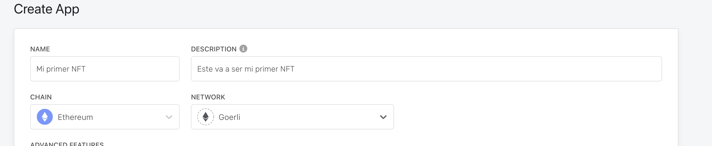

## Paso 3

Necesitamos una cuenta de Ethereum para poder enviar y recibir transacciones. Vamos a usar [Metamask](https://metamask.io/) como cartera virtual en el navegador que nos permitará gestionar la cuenta de Ethereum

Para ello, vamos a la URL y pulsamos _Download for_ 

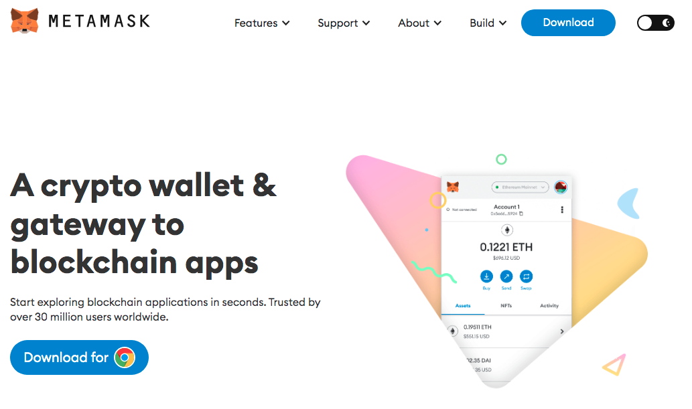

Añadimos la extensión:

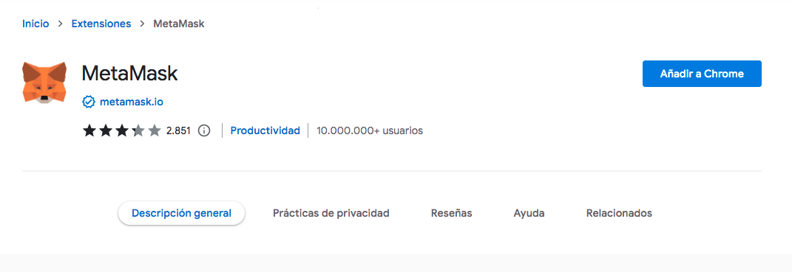

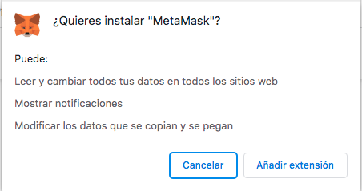

Al finalizar la instalación, se abre una nueva pestaña solicitandonos información. Seleccionamos _Crear una cartera nueva_:

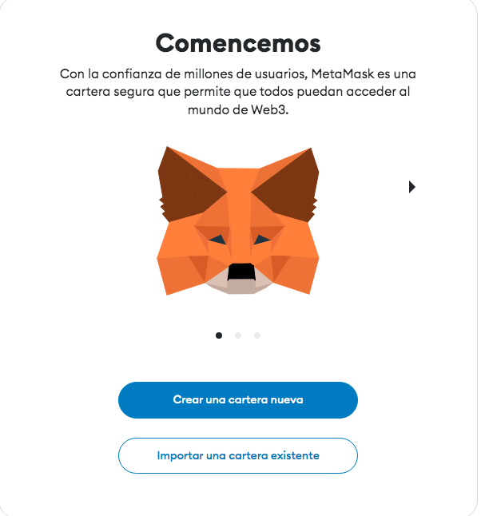

Ayudamos a mejorar Metamask enviando de forma anónima los datos de uso:

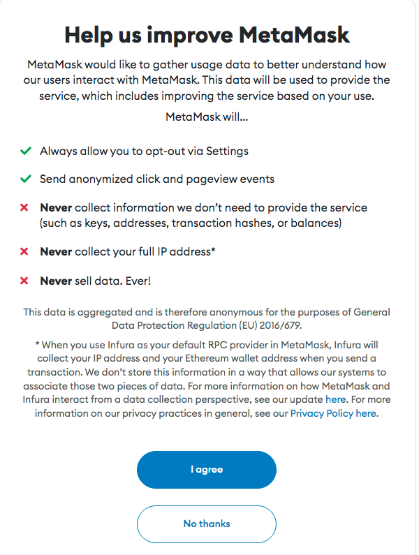

Creamos una contraseña y aceptamos los terminos:

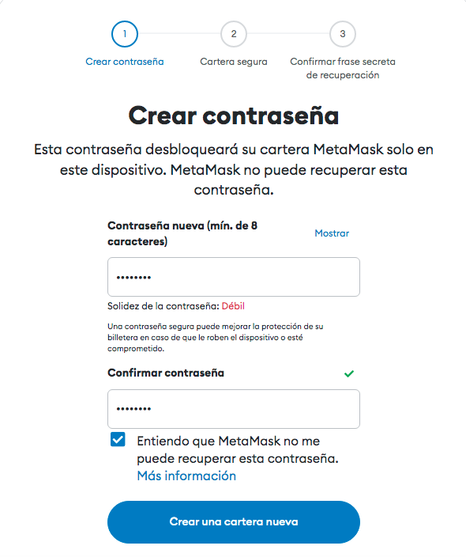

No es necesario proteger nuestra cuenta, seleccionamos _Recordarme más tarde (no recomendado)_:

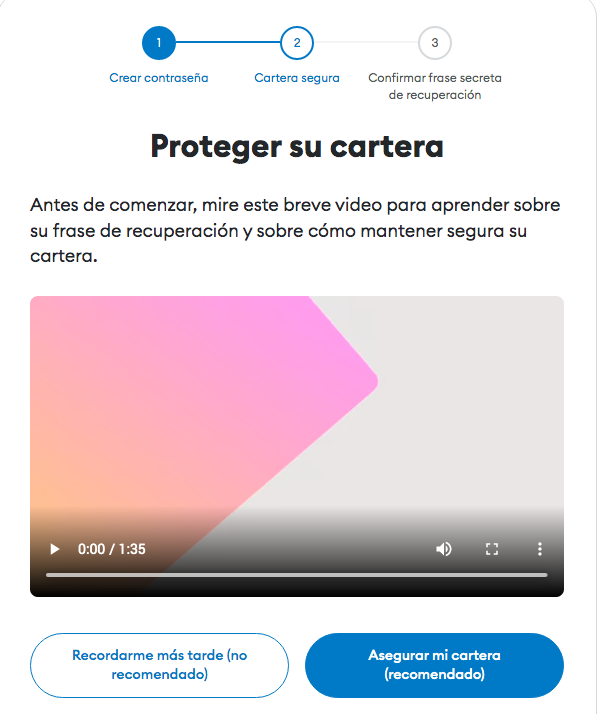

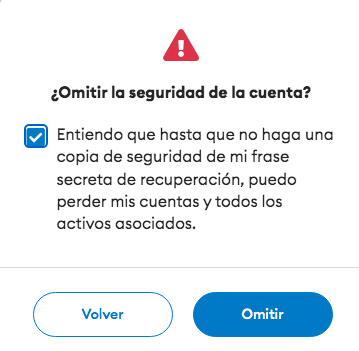

Si todo ha ido bien, hemos creado la cuenta en [Metamask](https://metamask.io/):

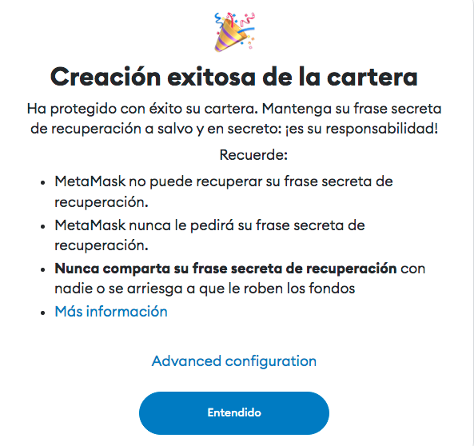

Para facilitar su uso, anclamos la extensión al navegador:

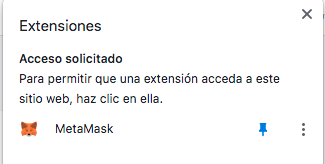

[Metamask](https://metamask.io/) viene preparado para interactuar con la red principal de Etherum. Vamos a cambiarlo para que use la red _Goerli Test Network_. Para ello, necesitamos activar las redes de prueba. Vamos a _configuración_, _Avanzado_ y _Mostrar redes de prueba_

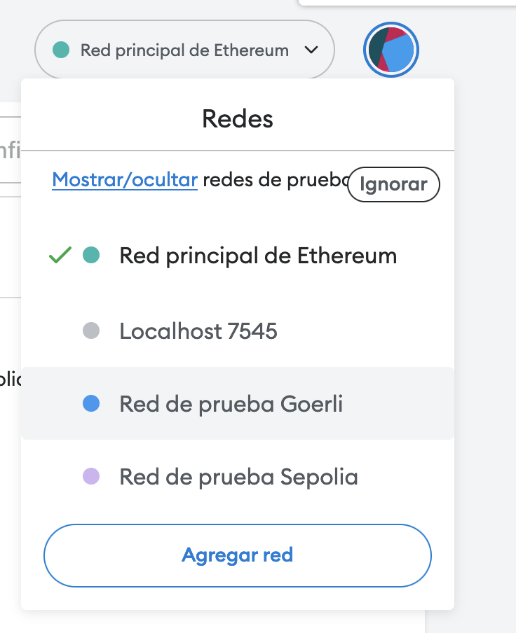

En el menú de configuración, seleccionamos _Redes_:


Y de ellas, seleccionamos la red _Red de prueba Goerli_ 

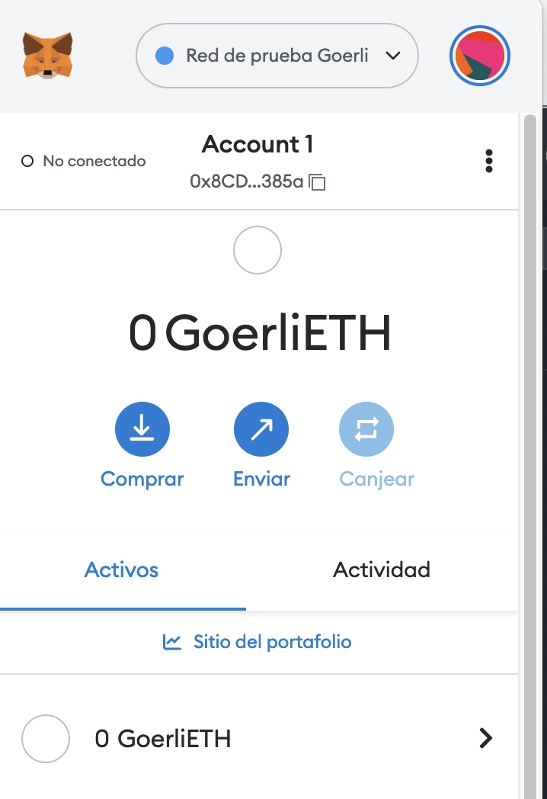

## Paso 4

Para poder desplegar el contrato inteligente en la red de prueba, necesitamos monedas _ETH_. Para ello podemos ir a [https://goerlifaucet.com/](https://goerlifaucet.com/) y hacer login con la cuenta que creamos en el paso 1.

Obtenemos la dirección de nuestra cartera desde Metamask:

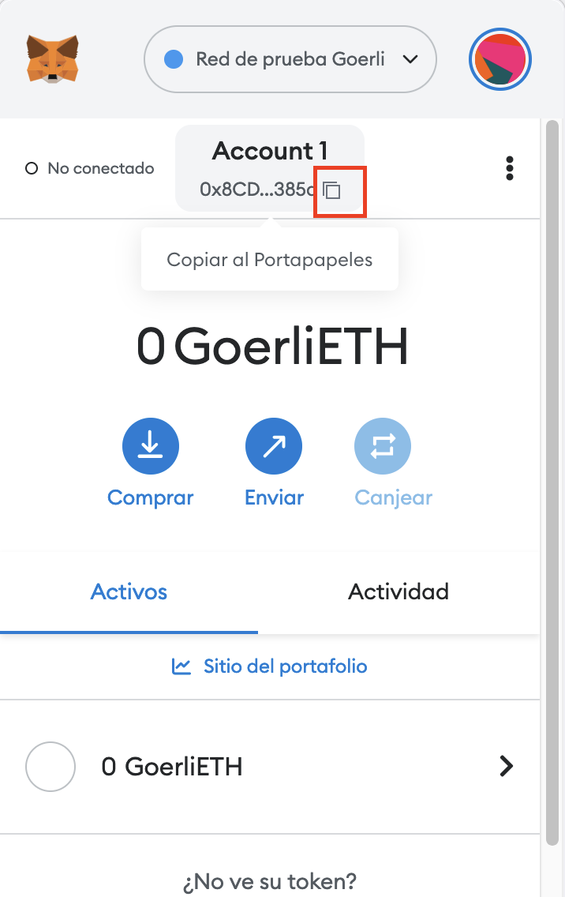

La insertamos y darle al botón _Send Me ETH_:

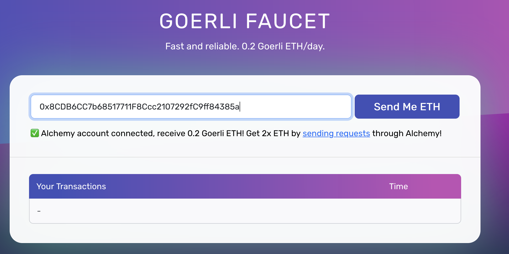

Si todo ha ido bien, se genera una transacción:

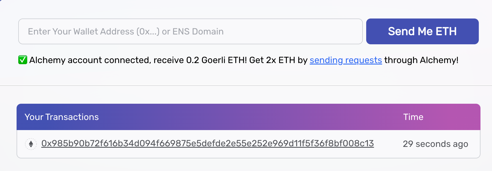

Y deberiamos tener saldo ficticio en nuestra cuenta:

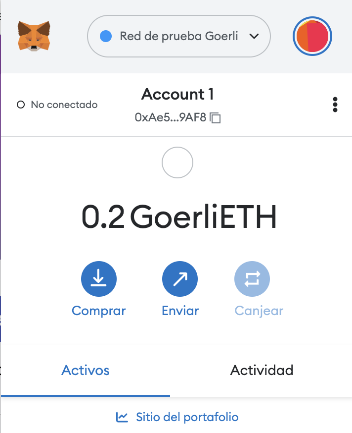

## Paso 5

Podemos comprobar nuestro saldo mediante una [herramienta de Alchemy](https://composer.alchemy.com/)

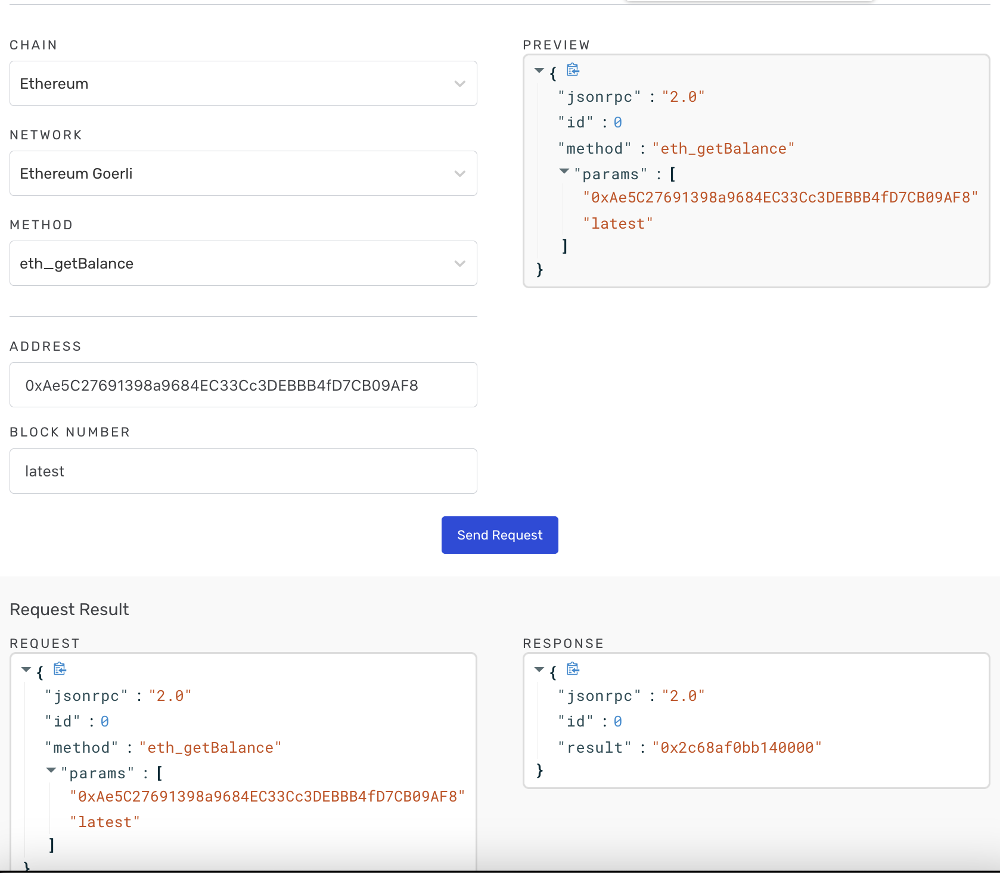

El resultado no es en _ETH_ sino en _wei_, sabiendo que:

1 eth = 10^18^ wei. 

Podemos convertir _0x2c68af0bb140000_ a decimal y vemos que son 200000000000000000 wei (0.2 GoerliETH).

## Paso 6

Vamos a crear el proyecto, para ello desde la linea de comando vamos a escribir:

    $ mkdir mi-primer_nft
    $ cd mi-primer_nft

Iniciamos el proyecto mediante NodeJS

    $ npm init

Podemos poner las opciones por defecto o cambiarlas

```json
{
  "name": "mi-primer_nft",
  "version": "1.0.0",
  "description": "Mi primer NFT",
  "main": "index.js",
  "scripts": {
    "test": "echo \"Error: no test specified\" && exit 1"
  },
  "author": "Marcos Pajón Ferreiro",
  "license": "MIT"
}
```

## Paso 7

Vamos a instalar [Hardhat](https://hardhat.org/) para poder compilar, desplegar y probar nuestro programa.

Dentro de la carpeta de nuestro proyecto _mi-primer_nft_ ejecutamos:

    $ npm install --save-dev hardhat

## Paso 8

Creamos un proyecto [Hardhat](https://hardhat.org/)

    $ npx hardhat

Vemos la pantalla de bienvenida y seleccionamos _create an empty hardhat.config.js_

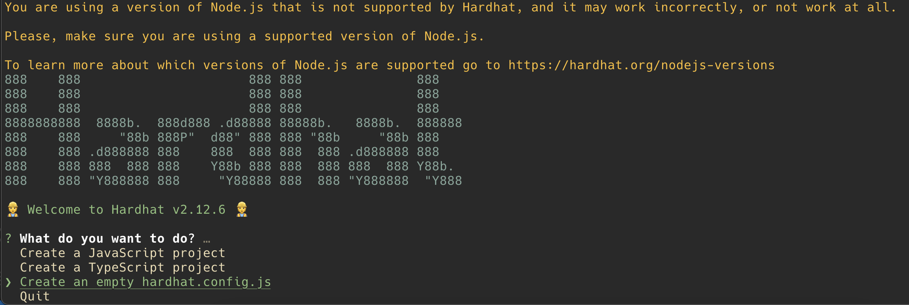

Esto nos genera un fichero _hardhat.config.js_ que configuraremos mas adelante.

## Paso 9

Añadimos dos carpetas a nuestro proyecto, _contracts_ _scripts_.

En _contracts_ es donde ubicaremos nuestro contrato inteligente de NFT

En _scripts_ es donde guardaremos los scripts de despliegue y podremos interactuar con nuestro contato inteligente

    $ mkdir scripts
    $ mkdir contracts

## Paso 10

¡Vamos a escribir el contrato! Para ello, necesitamos crear un fichero _ContratoNFT.sol_ dentro de la carpeta _scripts_ con el siguiente contenido:

```js
//Contract based on [https://docs.openzeppelin.com/contracts/3.x/erc721](https://docs.openzeppelin.com/contracts/3.x/erc721)
// SPDX-License-Identifier: MIT
pragma solidity ^0.8.0;

import "@openzeppelin/contracts/token/ERC721/ERC721.sol";
import "@openzeppelin/contracts/utils/Counters.sol";
import "@openzeppelin/contracts/access/Ownable.sol";
import "@openzeppelin/contracts/token/ERC721/extensions/ERC721URIStorage.sol";

contract ContratoNFT is ERC721URIStorage, Ownable {
    using Counters for Counters.Counter;
    Counters.Counter private _tokenIds;

    constructor() ERC721("ContratoNFT", "NFT") {}

    function mintNFT(address recipient, string memory tokenURI)
        public onlyOwner
        returns (uint256)
    {
        _tokenIds.increment();

        uint256 newItemId = _tokenIds.current();
        _mint(recipient, newItemId);
        _setTokenURI(newItemId, tokenURI);

        return newItemId;
    }
}
```

Como necesitamos el estándar ERC-721, vamos a importar las librerias necesarias ejecutando desde de la carpeta _contracts_:

    $ npm install @openzeppelin/contracts

## Paso 11

Vamos a conectar todo lo anterior: [Metamask](https://metamask.io/), [Alchemy](https://www.alchemy.com/) y nuestro contrato _ContratoNFT_

Como toda transacción requiere datos especificos secretos vamos a crear un fichero donde definir unas variables que luego usaremos dentro de nuestro proyecto:

En el raíz de nuestro proyecto, ejecutamos:

    $ npm install dotenv --save

Y creamos un fichero _.env_ con el siguiente contenido:

```properties
API_URL="https://eth-goerli.g.alchemy.com/v2/your-api-key"

PRIVATE_KEY="your-metamask-private-key"
```

Donde el valor de _API_URL_ será el valor de la API de la aplicación que creamos en [Alchemy](https://www.alchemy.com/)

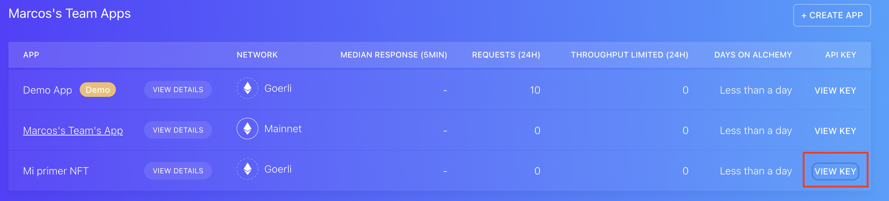

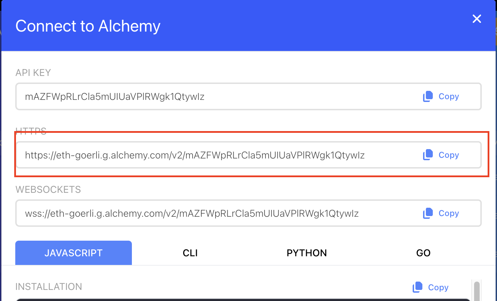

El valor del _PRIVATE_KEY_ será el valor de nuestra clave privada en [Metamask](https://metamask.io/)

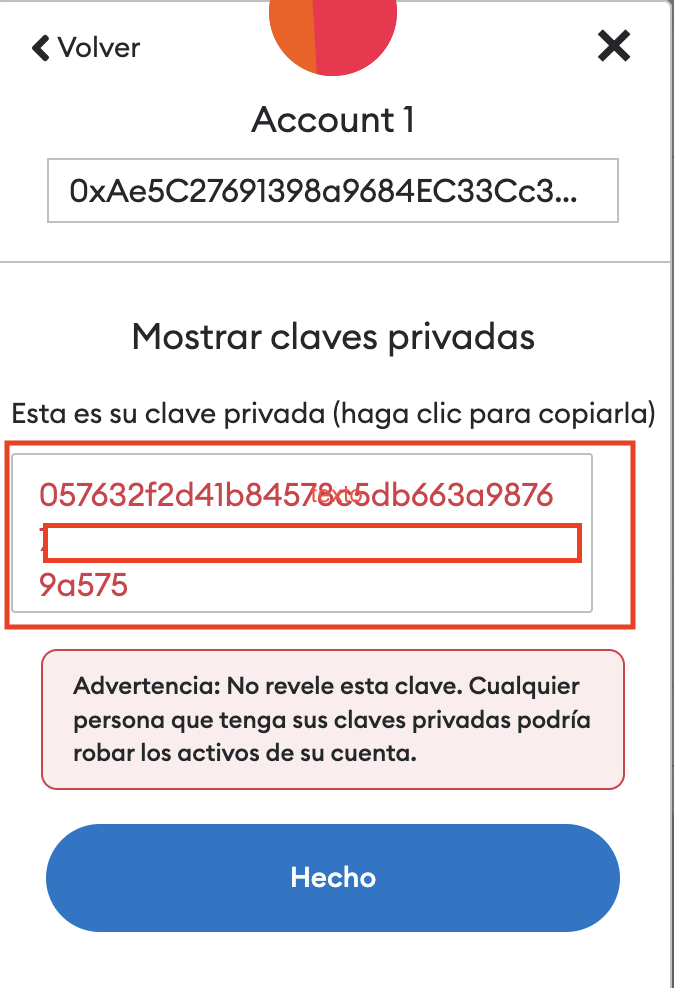

## Paso 12

Vamos a usar _Ethers.js_ para facilitar la comunicación y hacer peticiones a Ethereum envolviendo las peticiones REST en métodos mas sencillos.

Hardhart hace mas sencillo el uso de plugins, por lo que podemos usarlo para instalarlo. Ejecutamos en el raíz del proyecto:

    $ npm install --save-dev @nomiclabs/hardhat-ethers ethers@^5.0.0

## Paso 13

Necesitamos actualizar el fichero _hardhat.config.js_ con el siguiente contenido:

```js
/**
* @type import('hardhat/config').HardhatUserConfig
*/

require('dotenv').config();
require("@nomiclabs/hardhat-ethers");

const { API_URL, PRIVATE_KEY } = process.env;

module.exports = {
   solidity: "0.8.1",
   defaultNetwork: "goerli",
   networks: {
      hardhat: {},
      goerli: {
         url: API_URL,
         accounts: [`0x${PRIVATE_KEY}`]
      }
   },
}
```
## Paso 14

Vamos a ver si va todo bien compilando el proyecto

    $ npx hardhat compile

## Paso 15

Una vez que tenemos compilado el proyecto, vamos a crear nuestro script de despliegue. Para ello vamos a la carpeta _scripts_ y creamos un fichero _deploy.js_ con el siguiente contenido:

```js
async function main() {
  const MyNFT = await ethers.getContractFactory("ContratoNFT")

  // Start deployment, returning a promise that resolves to a contract object
  const myNFT = await MyNFT.deploy()
  await myNFT.deployed()
  console.log("Contract deployed to address:", myNFT.address)
}

main()
  .then(() => process.exit(0))
  .catch((error) => {
    console.error(error)
    process.exit(1)
  })

```

## Paso 16

Desplegamos nuestro contrato, ejecutando desde el raíz de nuestro proyecto:

    $ npx hardhat --network goerli run scripts/deploy.js

Si todo ha ido bien, deberiamos ver la sguiente salida:

    $ Contract deployed to address: 0xFF8E174a637abAA5c07B1EA0d8fc6eeC68b80605

Podemos ir a [Goerli Etherscan](https://goerli.etherscan.io/) y buscar el contrato que acabamos de desplegar

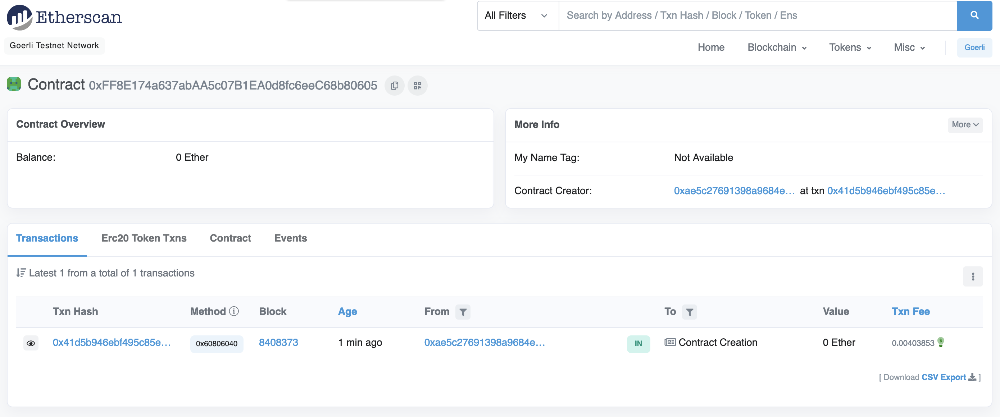

Seleccionando la transacción podemos ver los detalles:

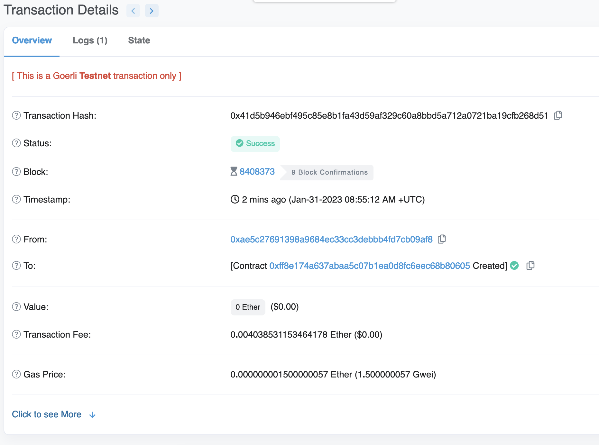

Vamos a "minar" nuestro NFT

## Paso 1

Instalamos web3 que es un herramienta similar a Ethers.js, para comunicarnos de forma sencilla con el blockchain de Ethereum. 

Para ello, desde el raíz del proyecto ejecutamos:

    $ npm install @alch/alchemy-web3

## Paso 2

Dentro de la carpeta scripts, creamos un fichero _mint-nft.js_ con el contenido:

```js
require("dotenv").config()
const API_URL = process.env.API_URL
const { createAlchemyWeb3 } = require("@alch/alchemy-web3")
const web3 = createAlchemyWeb3(API_URL)
```

## Paso 3

Nuestro contrato ABI (_Application Binary Interface_) es la interfaz del contrato inteligente. Hardhat generá automáticamente el ABI y lo guarda en el fichero _MiNFT.json_ de modo que tenemos que añadir al fichero anterior _mint-nft.js_ lo siguiente:

```js
const contract = require("../artifacts/contracts/ContratoNFT.sol/ContratoNFT.json")
console.log(JSON.stringify(contract.abi))
```

Quedando de la siguiente manera:

```js
require("dotenv").config()
const API_URL = process.env.API_URL
const { createAlchemyWeb3 } = require("@alch/alchemy-web3")
const web3 = createAlchemyWeb3(API_URL)
const contract = require("../artifacts/contracts/ContratoNFT.sol/ContratoNFT.json")
console.log(JSON.stringify(contract.abi))
```

Ejecutamos el script:

    $ node scripts/mint-nft.js


## Paso 4

Nuestro contrato inteligente coge una URL de un token y lo envia como parte de los metadatos del NFT en formato JSON. Para guardar las imagenes y obtener una URL para poder usar en el JSON vamos a usar el protocolo IPFS que es un protocolo descentralizado en una red de persona a persona que permite guardar y compartir información de forma descentralizada.